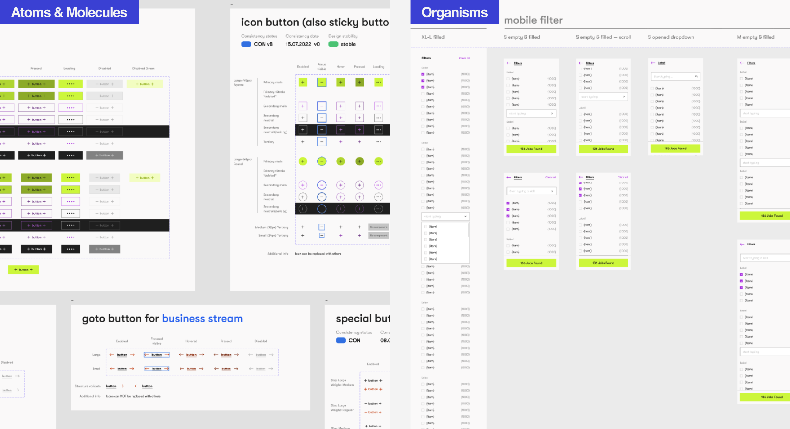
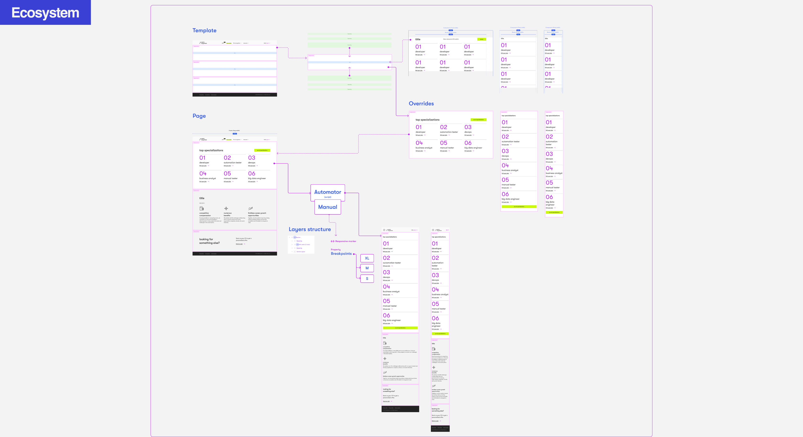
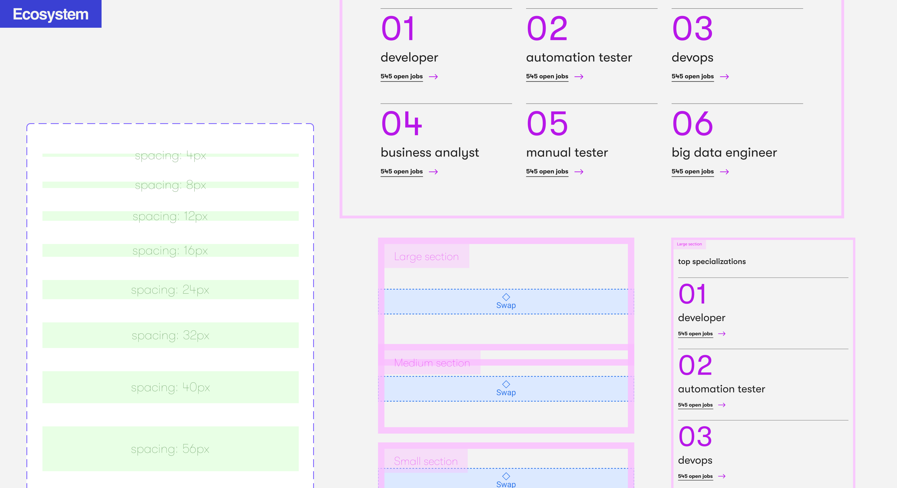



#### Team
I became a part of the product team during the dynamic 
redesign phase, collaborating with a talented group 
comprising designers, a product owner, a product manager, 
UX researcher, and developers. Over the course of two years, 
the team has experienced substantial growth.


#### Process
To build the components, I followed the Atomic Design 
Methodology, categorizing them into atoms, molecules, 
organisms, and ecosystems. I designed these components 
for both light and dark themes. Additionally, I established 
clear guidelines for using indentation when structuring 
content blocks, determining typography, and selecting colors.




#### Outcomes
The incorporation of the design system brought 
about consistency across products and expedited the 
creation of new pages. Within a span of four months, 
we successfully compiled an impressive repository of 
3,000 design elements, each tailored to specific devices 
and featuring various states and views. 
This endeavor significantly enhanced efficiency and 
maintained visual coherence throughout our projects.









#### Ecosystem
The decision was made to streamline and expedite 
the page design process by creating a dedicated library. 
This library became an ecosystem of pre-built sections 
that could seamlessly adapt to various resolutions and use 
cases, simplifying the overall design workflow.









#### Outcomes
Now the speed of creating designs for pages has increased from several days to several hours.






