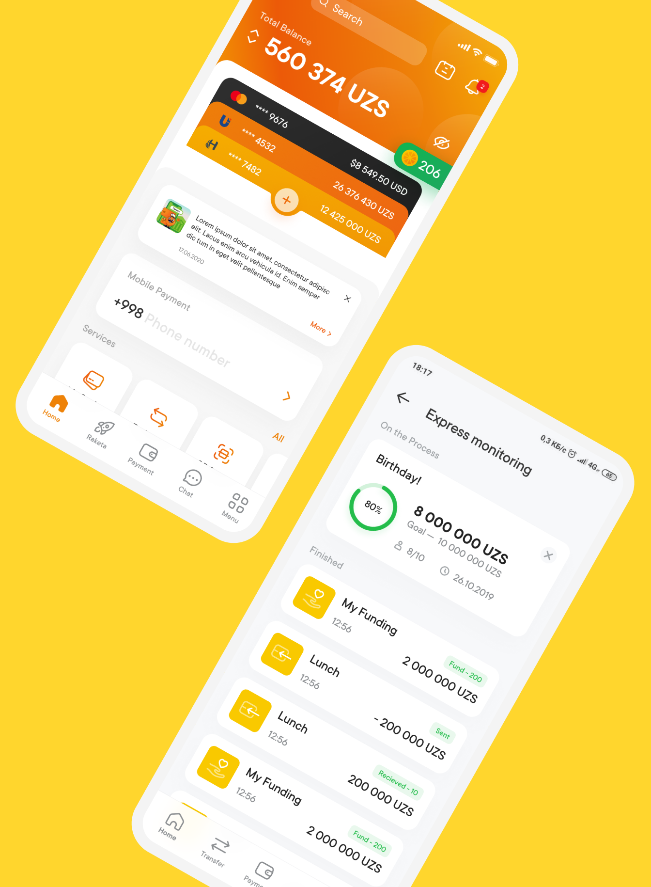
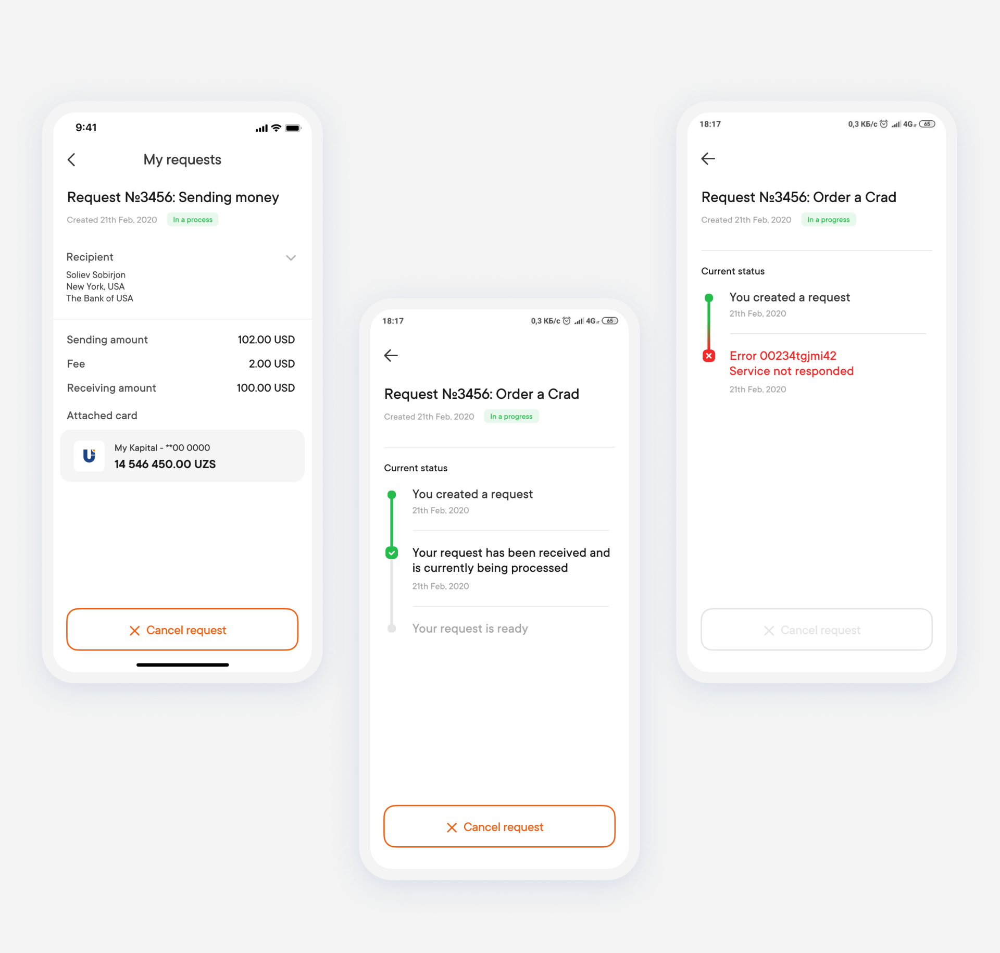
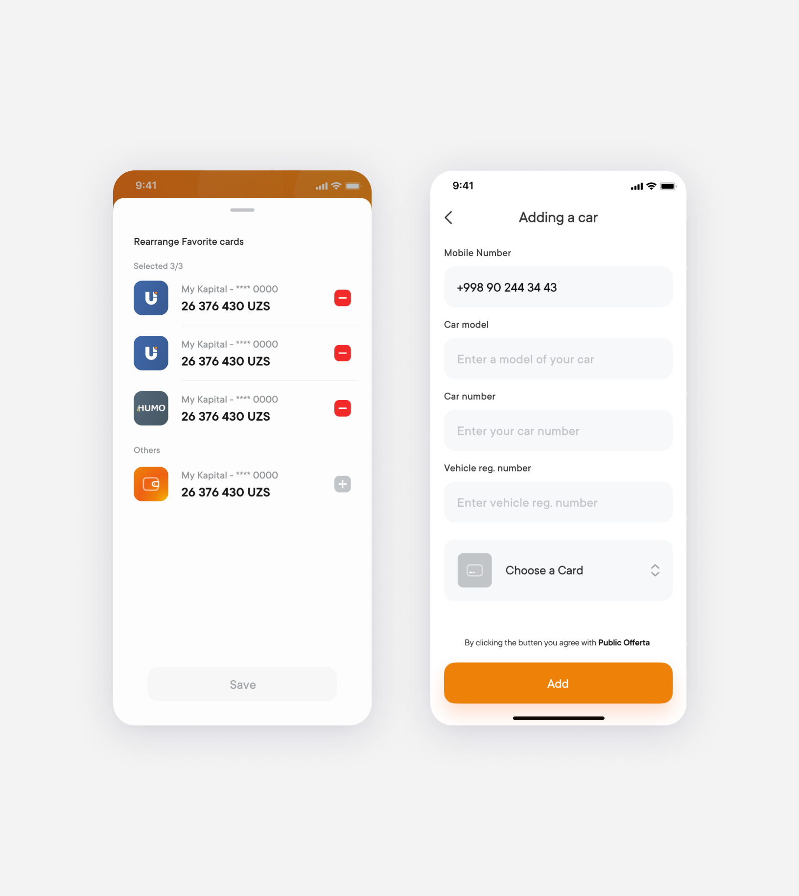
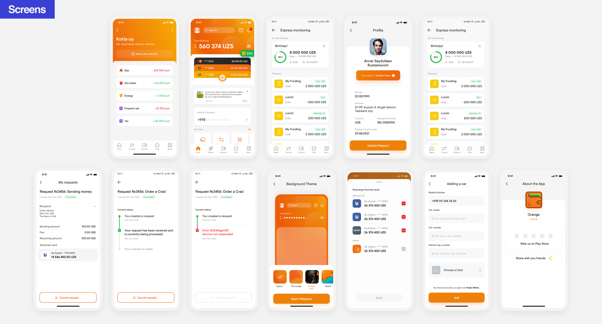



#### activities
Before new feature implementation I conducted a workshop with Product Managers to visual is etheir ideas and agree on MVP limitations. We did a couple interesting excersises starting from defining desired goals, expected pains and customer jobs and finishing with a sort of aflow chart. This investigation helped to come up with the designs fairly quickly.


#### results
Before new feature implementation I conducted a workshop with Product Managers to visual is etheir ideas and agree on MVP limitations. We did a couple interesting excersises starting from defining desired goals, expected pains and customer jobs and finishing with a sort of aflow chart. This investigation helped to come up with the designs fairly quickly.




#### my role
Before new feature implementation I conducted a workshop with Product Managers to visual is etheir ideas and agree on MVP limitations. We did a couple interesting excersises starting from defining desired goals, expected pains and customer jobs and finishing with a sort of aflow chart. This investigation helped to come up with the designs fairly quickly.









#### challenges
Before new feature implementation I conducted a workshop with Product Managers to visual is etheir ideas and agree on MVP limitations. We did a couple interesting excersises starting from defining desired goals, expected pains and customer jobs and finishing with a sort of aflow chart. This investigation helped to come up with the designs fairly quickly.












#### challenges
Before new feature implementation I conducted a workshop with Product Managers to visual is etheir ideas and agree on MVP limitations. We did a couple interesting excersises starting from defining desired goals, expected pains and customer jobs and finishing with a sort of aflow chart. This investigation helped to come up with the designs fairly quickly.

Before new feature implementation I conducted a workshop with Product Managers to visual is etheir ideas and agree on MVP limitations. We did a couple interesting excersises starting from defining desired goals, expected pains and customer jobs and finishing with a sort of aflow chart. This investigation helped to come up with the designs fairly quickly.

Before new feature implementation I conducted a workshop with Product Managers to visual is etheir ideas and agree on MVP limitations. We did a couple interesting excersises starting from defining desired goals, expected pains and customer jobs and finishing with a sort of aflow chart. This investigation helped to come up with the designs fairly quickly.















