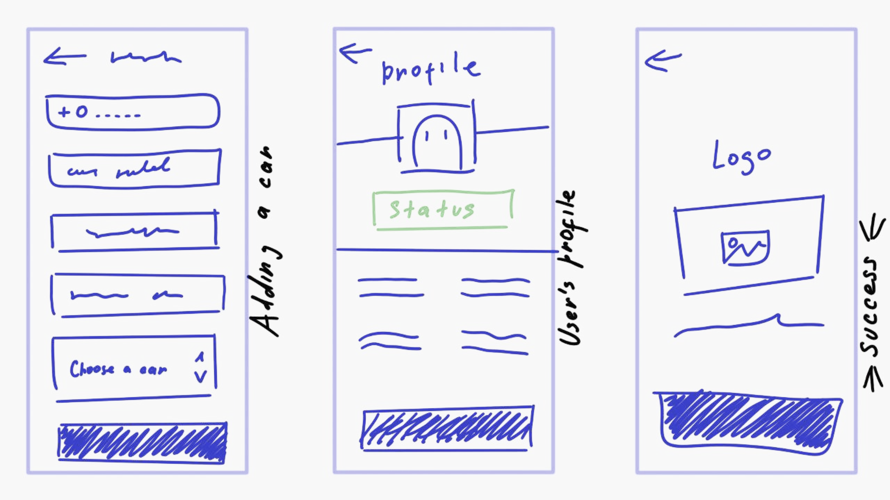



#### Team
On the project, I started working in a team with which we 
developed the product from scratch in accordance with the 
requirements. After the release, I moved to the position 
of lead designer and continued to support the product, 
taking part in the development of new products.


#### Activities
Designing wireframes and mockups, conducting user testing, 
collaborating with development team, continuously monitoring 
and improving the overall user experience of the product and design.




#### Results
My main achievement, and a source of great pride for me, is the product itself. 
It has achieved significant popularity in Central Asia, standing 
out for its exceptional user-friendliness compared to other similar 
applications in the region. The product serves as a prime example 
of a well-executed approach to developing a new and successful product.




#### Wireframes
To validate the insights collected from user interviews, 
I constructed a low-fidelity clickable prototype using Figma. 
This prototype was then tested with diverse users. 
The testing phase identified several issues, prompting 
redesigns of the screens to address these concerns effectively.














#### Design system in 2 months
As the senior designer on the team, my primary responsibility 
revolved around creating a comprehensive UI Kit and component library. 
This task played a pivotal role in our project, and I played a major 
role in its successful execution. Over a period of two months, 
we accomplished the remarkable feat of creating and finalizing 
a comprehensive library comprising 4,000 elements. 
This library catered to the needs of various platforms, 
including the mobile application, marketplace, and web transition projects. 
The completion and approval of this extensive component 
library marked a significant milestone in our overall design efforts.












#### User testing
When faced with a tight time frame, finding the right type of 
user testing becomes crucial, especially for fintech applications 
that require quick user orientation amidst a plethora of functionalities. 
To address this challenge, we opted for 5-second tests 
during the testing phase of wireframes and prototypes. 
This approach allowed users to perform specific actions 
within a limited timeframe, providing valuable insights into 
their quick comprehension and navigation of the application's functionalities.














