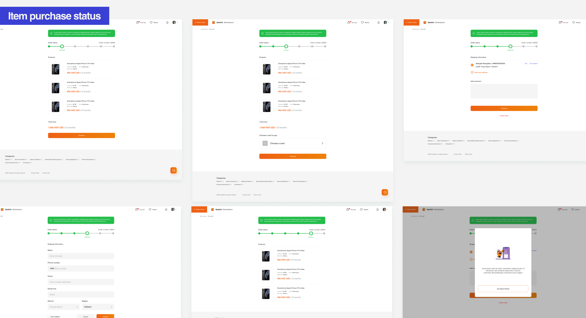
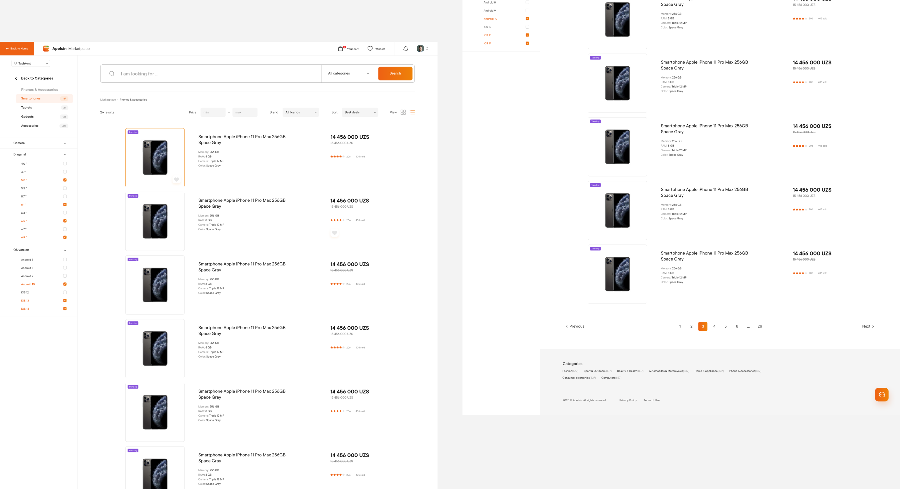



#### activities
Prior to implementing the new feature, I facilitated a workshop with Product Managers to visualize their ideas and establish agreement on MVP limitations. During the session, we engaged in various interesting exercises, ranging from defining desired goals and expected challenges to identifying customer needs and jobs. The outcome included a flow chart of the process. This thorough investigation proved instrumental in expediting the design process, allowing us to develop the designs swiftly and effectively.


#### results
Three months before the MVP release, I became an integral part of the project, focused on ensuring its timely delivery. My role involved working with the existing library and expanding it by introducing new components. By immersing myself in every aspect of this extensive project, I gained a profound understanding of its intricacies and complexities. This holistic involvement proved invaluable in contributing to the successful delivery of the product.



















#### Result
The product received a highly positive response and rapidly attracted its first users. Our collaboration with the bank allowed us to offer new clients a reduced price, which served as a strong incentive for them to try out the new service. This strategic partnership played a significant role in driving early adoption and fostering a successful launch for the product.


























