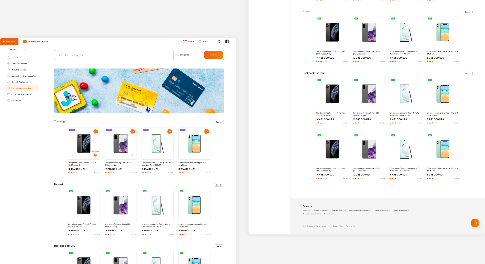



#### activities
Before new feature implementation I conducted a workshop with 
Product Managers to visual is etheir ideas and agree on MVP limitations. 
We did a couple interesting excersises starting from defining 
desired goals, expected pains and customer jobs and finishing 
with a sort of aflow chart. This investigation helped to come up 
with the designs fairly quickly.


#### results
Before new feature implementation I conducted a workshop with 
Product Managers to visual is etheir ideas and agree on MVP limitations. 
We did a couple interesting excersises starting from defining 
desired goals, expected pains and customer jobs and finishing 
with a sort of aflow chart. This investigation helped to come up 
with the designs fairly quickly.














#### challenges
Before new feature implementation I conducted a workshop with 
Product Managers to visual is etheir ideas and agree on MVP limitations. 
We did a couple interesting excersises starting from defining 
desired goals, expected pains and customer jobs and finishing 
with a sort of aflow chart. This investigation helped to come up 
with the designs fairly quickly.






