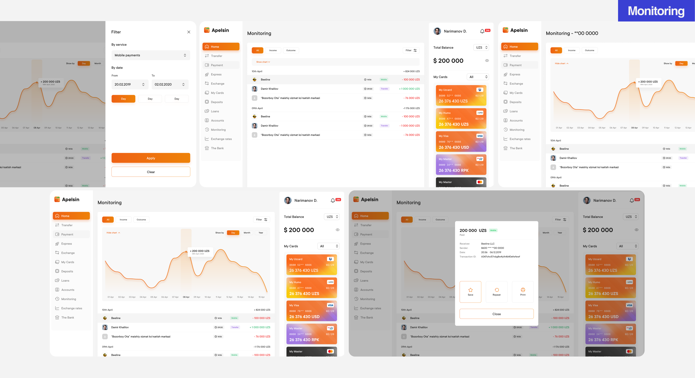



#### Background
Before new feature implementation I conducted a workshop with Product Managers to visual is etheir ideas and agree on MVP limitations. We did a couple interesting excersises starting from defining desired goals, expected pains and customer jobs and finishing with a sort of aflow chart. This investigation helped to come up with the designs fairly quickly.


#### Challenges
The project presented a significant challenge as I aimed to create an experience that seamlessly accommodates users with varying levels of technical expertise. Balancing the needs of both novice and advanced users proved crucial, as I worked to avoid intimidating newcomers with complex features while ensuring advanced users had ample customization options. Striking this delicate balance was key to achieving an intuitive and user-friendly design.




#### Results
This project served as a valuable opportunity for me to consolidate and apply all of my accumulated knowledge. I adeptly translated mobile designs to the web, documented a substantial collection of design patterns, effectively communicated design decisions with stakeholders, and confidently advocated for my chosen solutions. Through this experience, I honed my skills and further strengthened my expertise in the field.
















