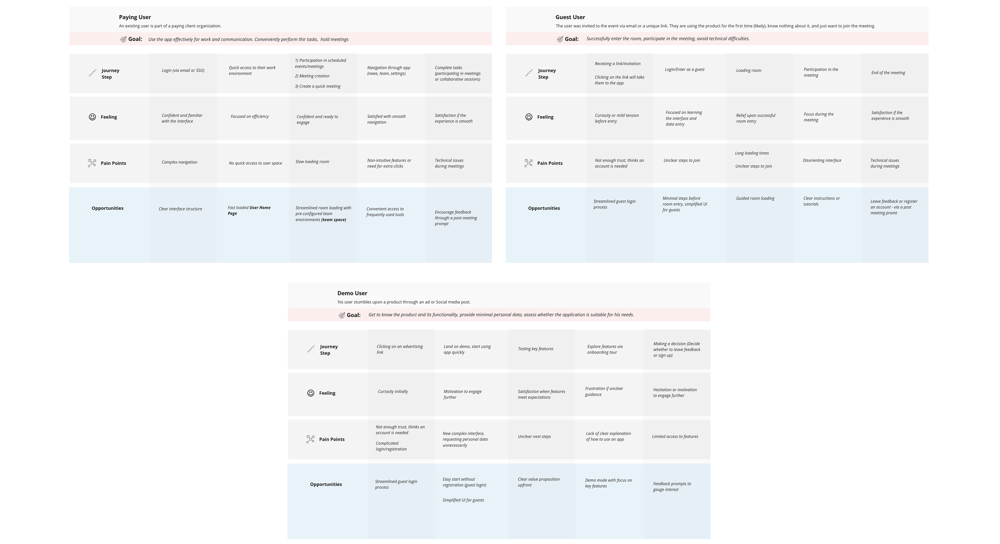
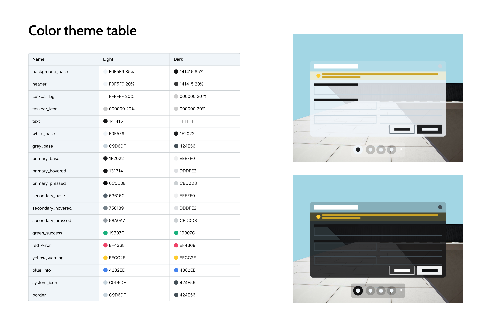
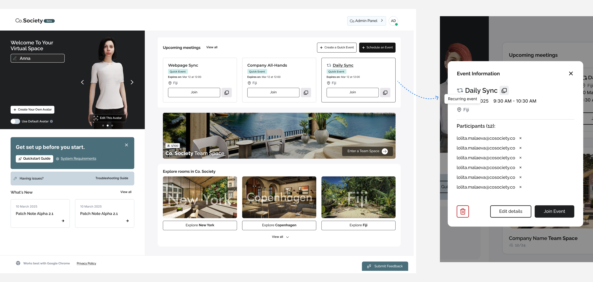



#### My Role & The team
As the Product Designer, I led the design strategy within a cross-functional product team (product owners, art manager, marketing lead, tech lead). I managed two junior UI/UX designers and provided guidance to the frontend and TechArt teams.

**Stack:** Figma, Miro, Rive, UI Toolkit, HubSpot, TypeForm


#### Key challenges & Solutions
##### Tight Deadlines & Unusual Tech Stack:
One of the biggest challenges was delivering results on a tight schedule while working with a unique tech stack—specifically, transitioning to Unity’s UI Toolkit. This required quickly mastering UXML and USS, which are fundamentally different from standard HTML/CSS. I addressed this by running rapid prototyping sessions, actively collaborating with developers, and leveraging my web design background to bridge the knowledge gap.
##### Niche Product Concept:
Designing for a niche, unfamiliar product concept meant users could feel lost. I solved this by intentionally embedding familiar interaction patterns and clear navigation, making the experience intuitive even for new users.





#### Research
I spearheaded user research: gathering feedback, identifying user personas, and building Customer Journey Maps. This approach let us quickly move to prototyping user flows and wireframes with a strong focus on pain points and critical moments.











#### Flow design & Wireframes
To accelerate delivery and maximize clarity for stakeholders, I combined flowcharts and wireframes—an approach that streamlined team communication. I optimized onboarding flows, ensuring users could easily join meetings or create an account, no matter their digital confidence.











#### Branding & UI
I drove the creation of a robust design system based on the brandbook, enabling support for both light and dark themes. The focus was on a clean, distraction-free interface.

















#### High-fidelity wireframes & Usability testing
I spearheaded usability testing based on interactive prototypes and carefully crafted scenarios. Success was measured by how easily users could start or join meetings. Test groups included people with varying degrees of digital literacy.



































#### HUD & In-Game UI Design
##### Tools:
- Led UI design with UI Toolkit (Unity’s native framework: UXML & USS)
- Prototyped interactions in Figma
- Created animations and interactive elements in Rive and After Effects
- Coordinated changes via GitHub





#### UI structure & Focus areas
I structured the UI to clearly separate zones of interest, ensuring logical layouts and smooth user journeys.























#### Results
- 90% of users rated their experience 8/10 or higher (TypeForm feedback)
- Over half of first-time users converted to paid plans, thanks to a non-intrusive, streamlined onboarding flow
- Within six months, the product secured several major Swedish clients who highlighted the clean, intuitive UI as a core strength

