

#### Background
anywhere.epam.com stands as a leading global platform that empowers IT professionals worldwide to access flexible employment options. This dynamic platform daily presents an extensive selection of up-to-date job vacancies, invaluable resources for professional growth, and an unparalleled level of candidate engagement.


#### My role
I was brought onboard during the crucial redesign phase, a time marked by a fundamental reassessment of the brand's core values. My role allowed me to contribute significantly to the comprehensive restructuring of the platform, driving the transition to a new, user-friendly UI and facilitating ongoing product enhancements. Working as part of a robust team, my primary interactions were with delivery managers, marketing specialists, business analysts, as well as development and testing teams.




#### Redesign
The existing platform interface, though functional, had become visually outdated and fell short in offering intuitive user interaction patterns. This realization necessitated a thorough overhaul. Through the redesign process, noticeable transformations took place on the job pages, blog, and SEO. Beyond aesthetics, the navigational flow improved, effectively drawing user focus towards CTAs and essential information. The end result was a cleaner, streamlined user journey and improved performance metrics, which collectively led to a marked rise in conversion rates, as seen in increased clicks on the 'Apply' button.




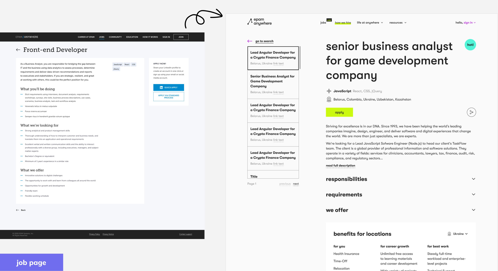




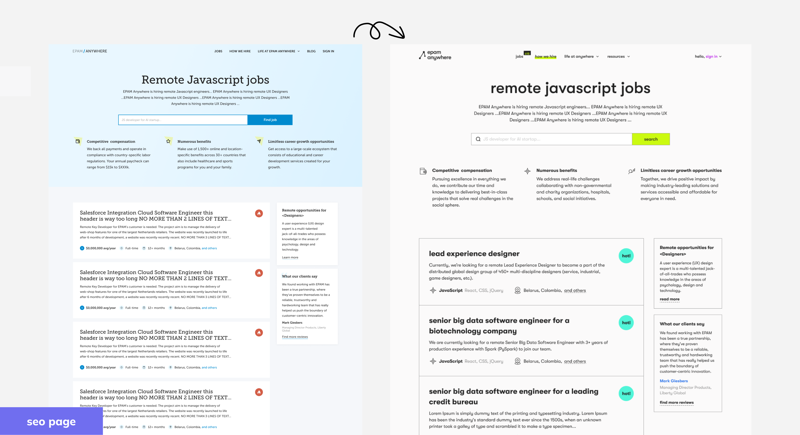




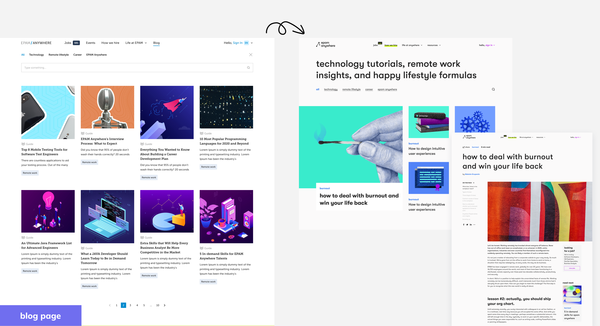




#### Unveiling a Fresh, Invigorating UI
The platform transitioned from a traditional corporate style to a vibrant, minimalistic yet energetic design, effectively appealing to the creative, unconventional individuals that make up our target audience. Surveys conducted among candidates and existing Epam Anywhere employees during the brand transition research reinforced the effectiveness of this approach.




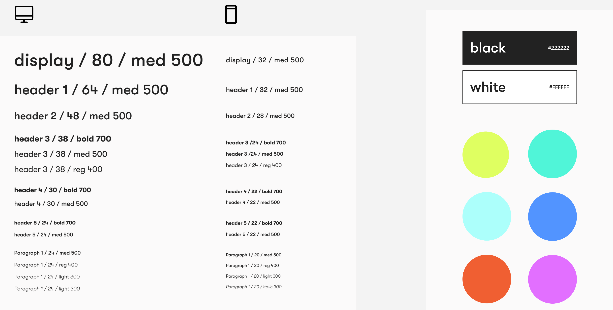




#### Work highlights
The magnitude and complexity of this project were enormous, with the range of activities I participated in over two years continually surprising me. Despite the occasional technical and time constraints, I discovered the true value of quick, accurate design decisions.




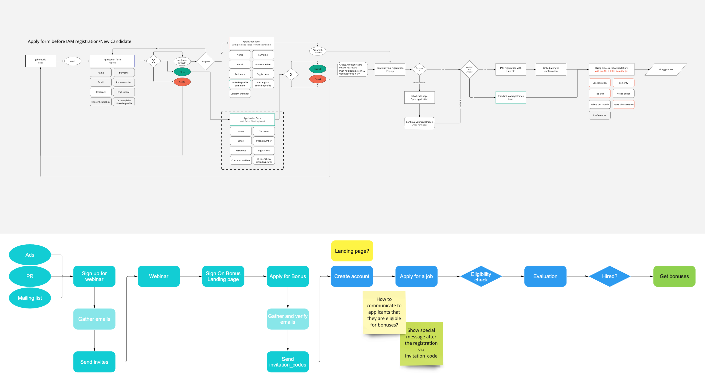




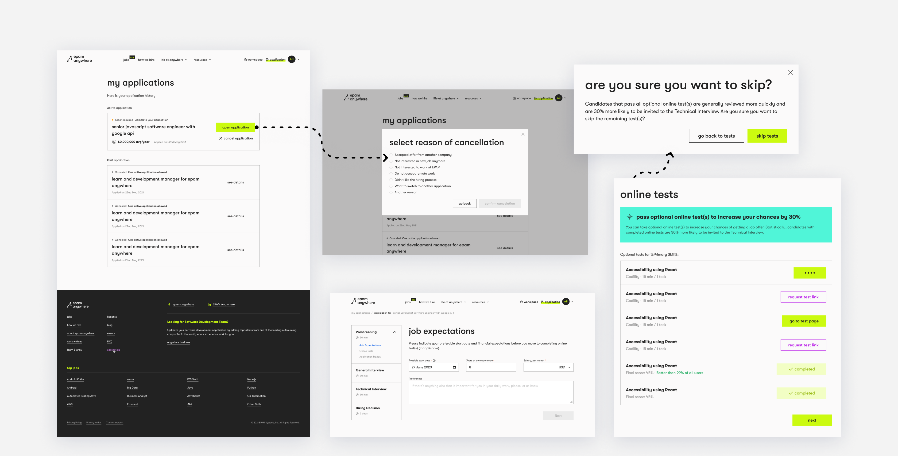




#### Refining the Hiring Flow
A transparent and comprehendible job application review process is a cornerstone of successful recruitment. Therefore, my work on this aspect aimed to provide a comforting user experience throughout the process, ensuring necessary information was always accessible.




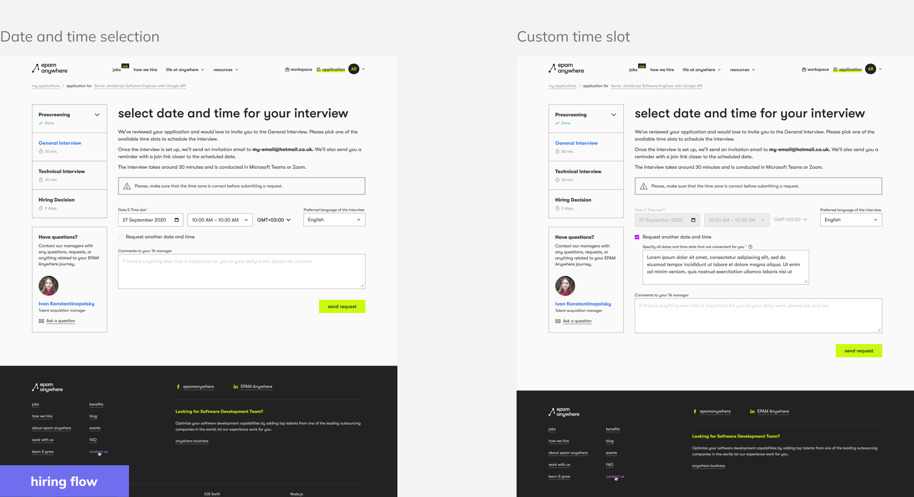




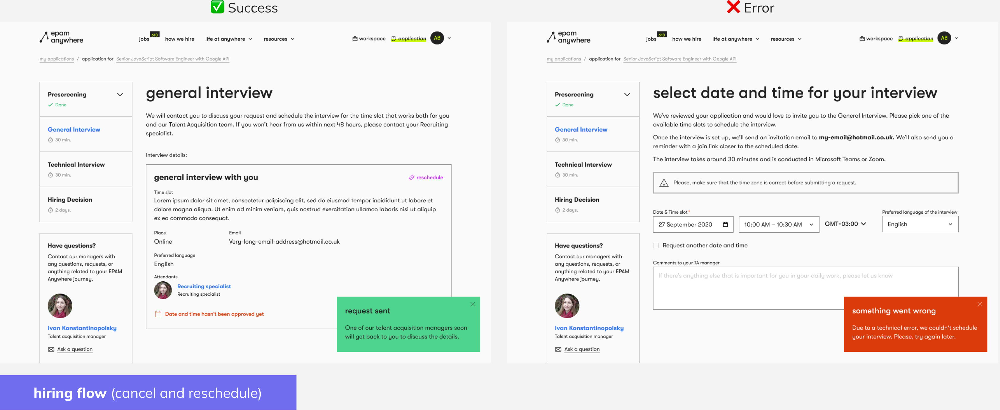




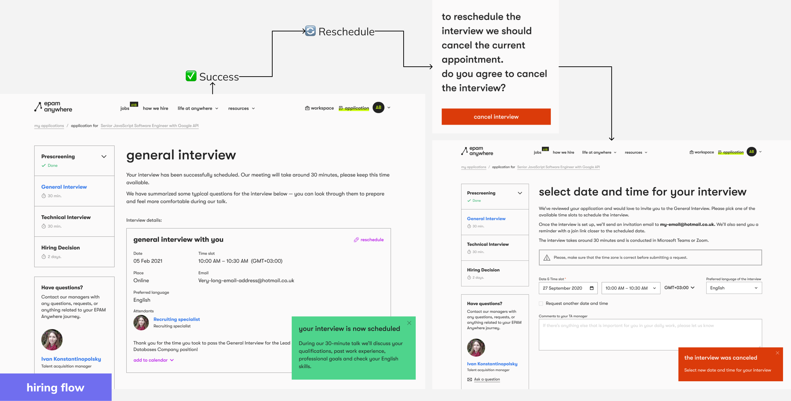




#### Competitor Insights
Understanding the market landscape, our strengths, weaknesses, and those of competitors, is pivotal for successful product evolution. Our design team's in-depth research led to numerous hypotheses, which, when implemented, significantly enhanced our product.

One notable feature was the ability for users to save jobs. This seemingly simple functionality provided a powerful tool for users to manage their career opportunities effectively, encouraging them to revisit and engage with the platform.









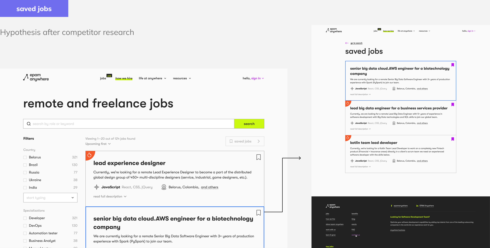




#### AI Innovations
Innovative solutions like the AI interviewer streamlined the pre-screening process for candidates, effectively automating tasks for hiring managers. Users complete necessary fields and engage with a chatbot, replicating both general and technical interview scenarios.

The AI CV Builder is another user-centric tool we developed, catering to candidates who may not have an updated CV when an interesting job opportunity appears. This intuitive tool lets candidates create attractive and content-rich resumes with AI's assistance, enabling them to apply for jobs directly from the platform.




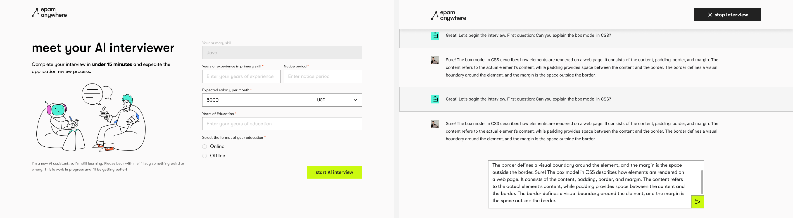




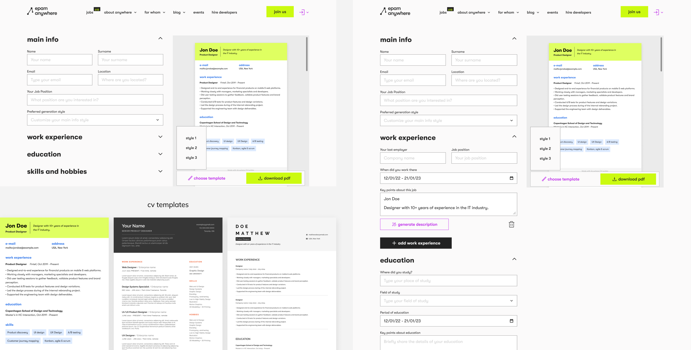




#### Graphics
Utilizing my coding skills and ContactMonkey tool, I designed visually appealing and informative emails to enhance candidate and employee experience. Additionally, I developed graphic elements for blog pages, using vibrant creatives to boost user engagement.




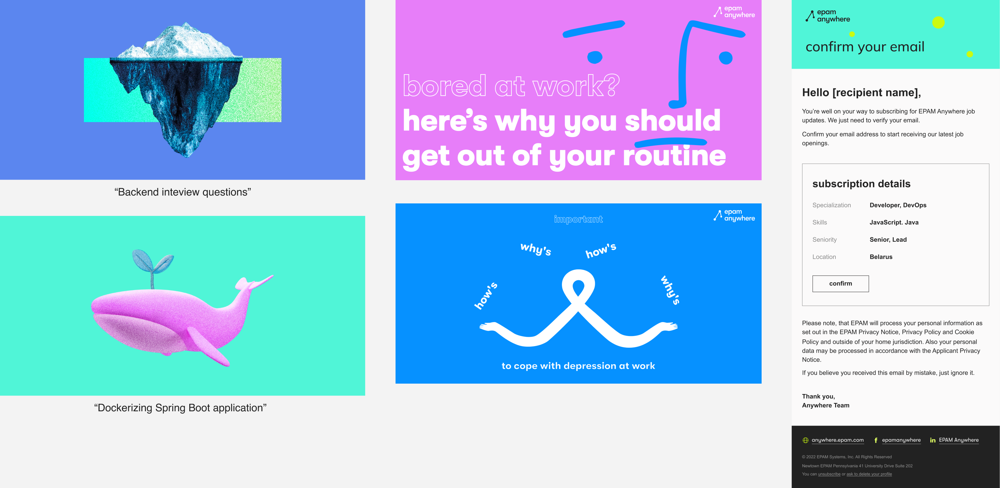




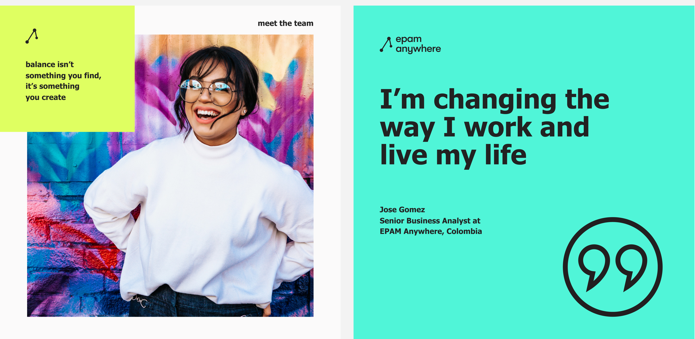






