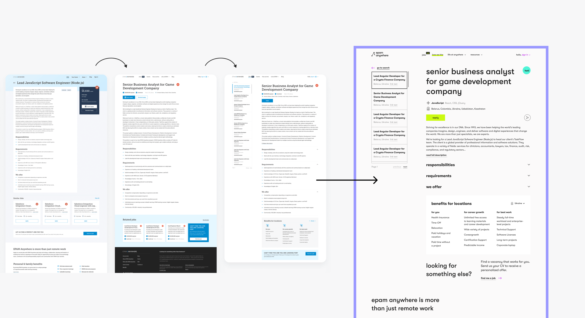
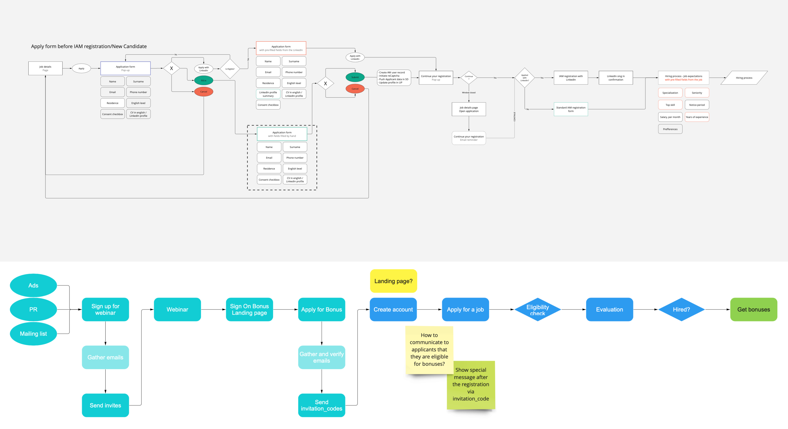
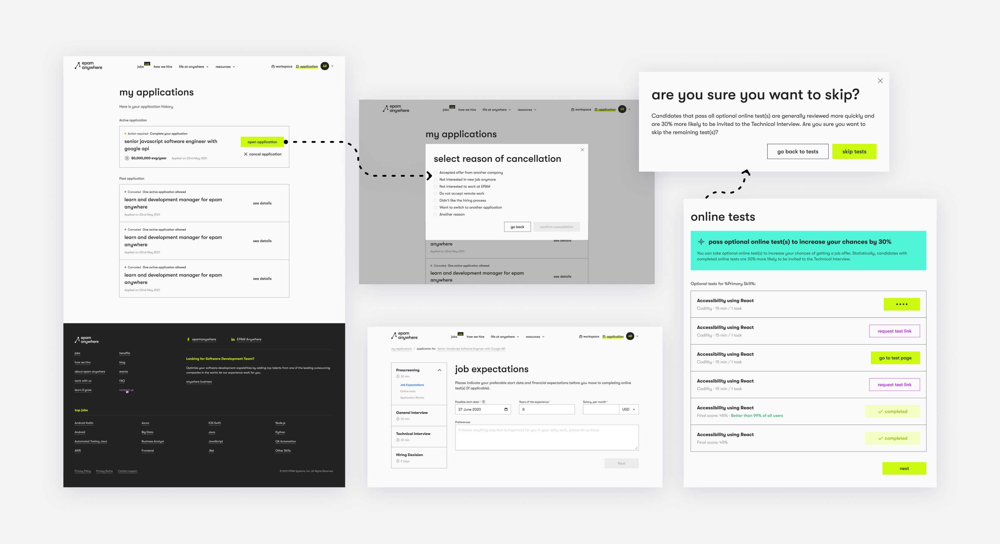
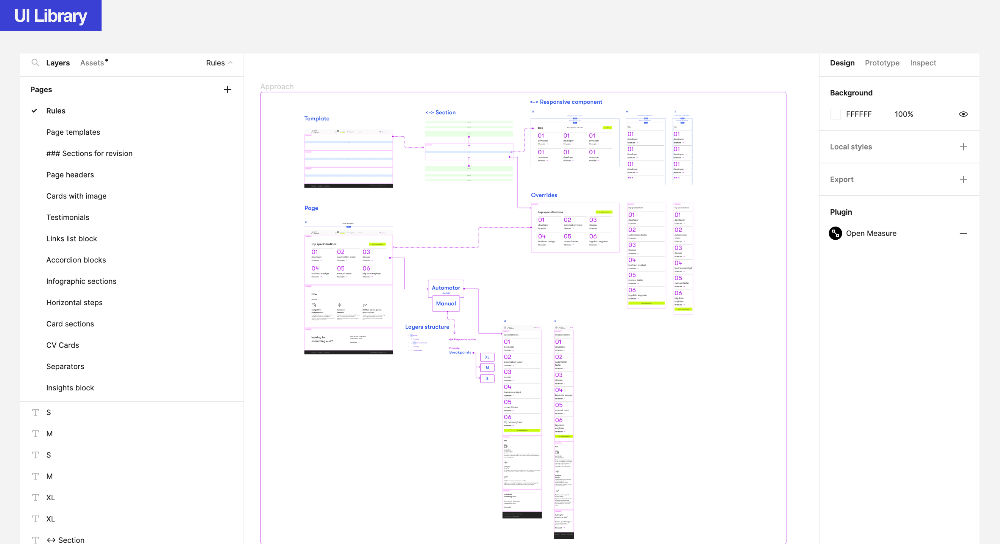
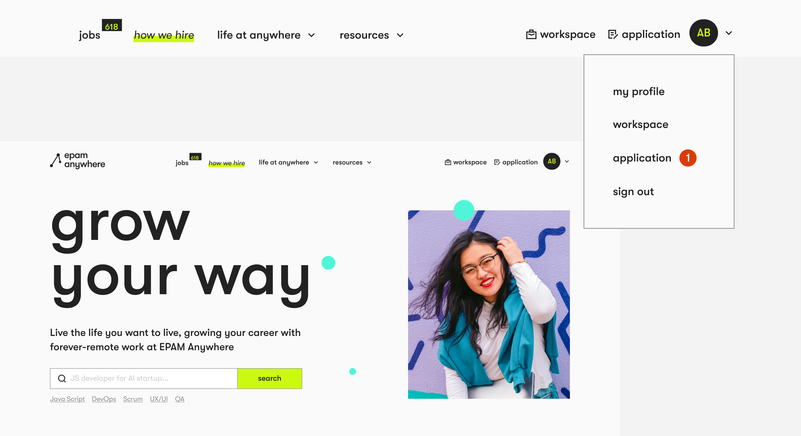
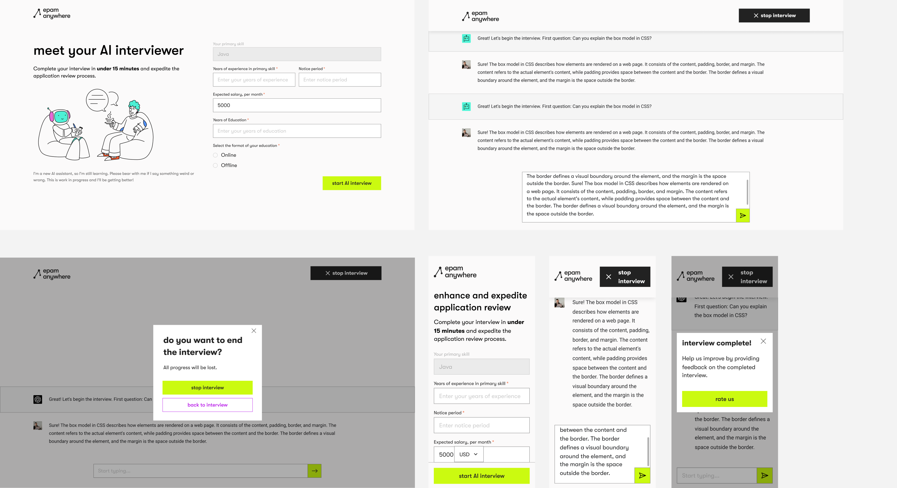
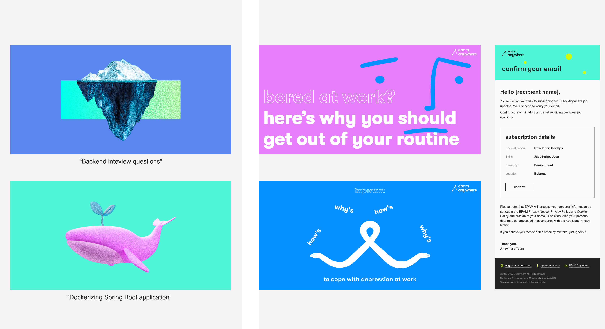



#### My role
During the project's active growth and redesign phase,
I became a valuable member of the team.
I played a crucial role in successfully transitioning
to a new brand and creating a fresh design system.
Additionally, I actively contributed to the project's
ongoing development by conducting user research and testing,
resulting in improved conversion rates and user experiences.
Furthermore, I had the opportunity to design interfaces
for new platform services and collaborate on developing
new graphic solutions for our brand.


#### Challenges
As the project entered its active development phase,
I encountered a substantial influx of diverse tasks,
demanding a honed skill in task prioritization
aligned with business requirements.
My primary focus during this phase was to efficiently
manage a tight schedule and provide timely support to various teams.




#### Redesign
During the transition to a new brand, the product
underwent substantial changes, resulting in a complete
overhaul of its appearance and functionality.
Take a glimpse of how the Job Page evolved during
the redesign process:









#### User flow
With meticulous attention to detail, 
I extensively reworked numerous pages and created new ones, 
all while thoughtfully designing the user flow. 
Throughout this process, I ensured that both business 
requirements and my own expertise were taken into 
careful consideration.














#### User research
As an integral part of the product development process, 
I actively engaged in various user research initiatives, 
including conducting in-depth user interviews and performing 
competitor analysis. These efforts proved invaluable in 
identifying the product's weaknesses and informed well-founded 
design decisions. The user insights gained from these research 
activities played a pivotal role in shaping a more user-centric 
and effective product.









#### Product improvement
A comprehensive series of studies played a significant 
role in enhancing the product's user-friendliness. 
This effort encompassed a range of improvements, from 
small yet impactful innovations like adding hints to the 
main page's search feature and notifying users about 
unfilled applications, to more substantial enhancements 
such as introducing a dedicated page for saved vacancies 
in the personal account. These improvements collectively 
resulted in a more user-centric and satisfying experience for our users.














#### Various activities
In addition to my major contributions, I actively engaged 
in various smaller activities on the project. 
One notable example was creating and designing an 
interface for a distinct service that leveraged 
AI for candidate interviews. This innovative solution 
significantly improved the efficiency of hiring managers 
and considerably reduced pre-screening time, 
leading to a more streamlined and effective hiring process.









#### Graphic design
My colleagues highly valued my strong visual taste 
and creativity, which led to my active involvement in 
the creation of graphic materials for our product.






