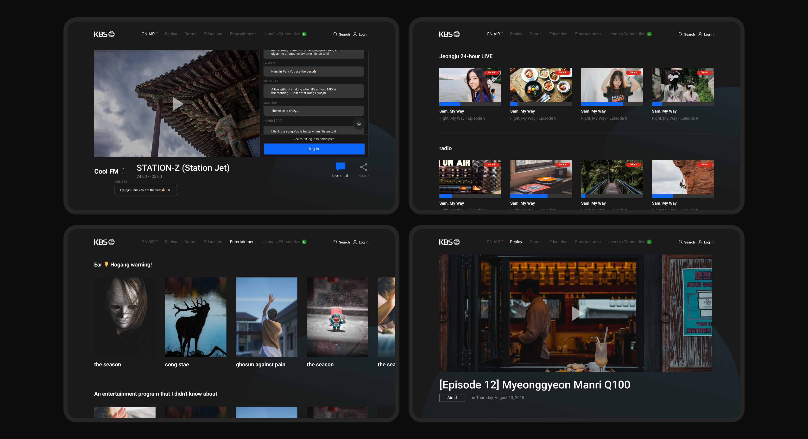



#### My role
I played a key role in designing an effective user path for this web application, along with developing a comprehensive UI Kit and conducting post-development layout reviews.


#### Results
Presently, the service has undergone rigorous testing and implementation, garnering immense appreciation from listeners worldwide.






