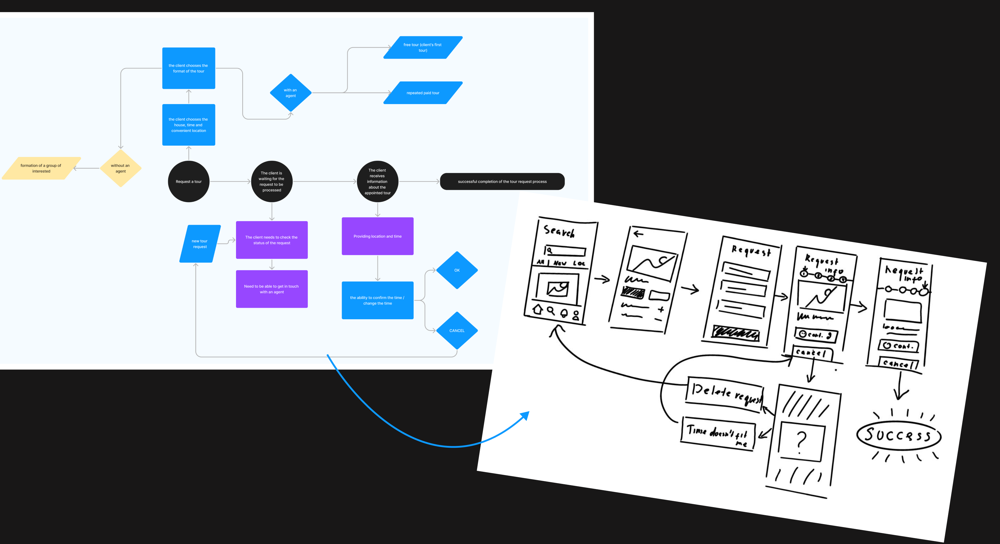



#### Customer portal
Customer Portal including a home configurator allowing customers to select and customize their home type and tracking system for their project, home production time and delivery.


#### Mobile app
My primary focus was on developing a mobile application with a virtual reality feature, enabling users to book house tours of their desired properties. Throughout this process, I collaborated closely with stakeholders and frequently had to justify and defend my design decisions. Additionally, I worked on crafting internal tools to streamline production regulation at the factory, as well as creating a customer portal for seamless interactions.






















#### Results
The implementation of customer portal tool has significantly improved the efficiency of sales managers and heightened the engagement of home buyers throughout all stages of the home production processes.









#### erp
I worked on an enterprise ERP system built on Odoo, but due to confidentiality agreements, I am unable to showcase it in my portfolio. Nevertheless, this experience was highly valuable, allowing me to contribute to a complex and confidential project.

