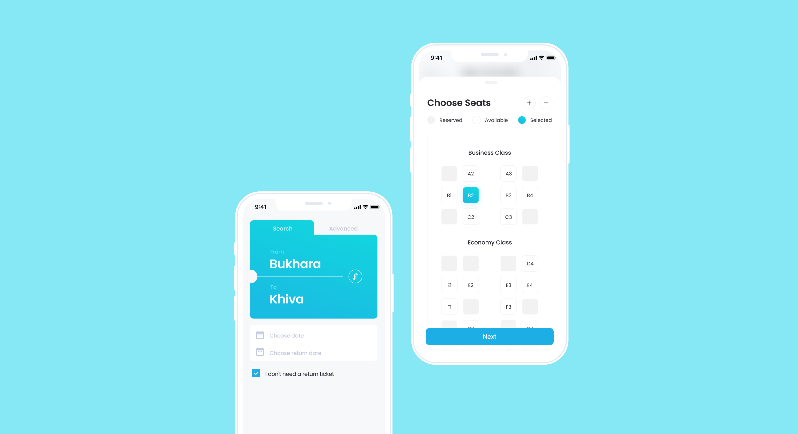
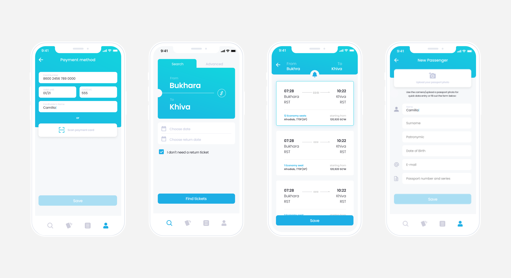



#### My role
As the primary designer on this project, I played a key role, providing continuous support throughout every stage of its development.


#### results
The application has enjoyed sustained popularity in its domain, lauded for its user-friendly and intuitive interface. My experience with this product has honed my ability to work efficiently, particularly when creating a multitude of intricate and highly detailed screens.









#### challenges
During the application's design process, I encountered situations where I had to vigorously defend specific design solutions due to limited development resources. Despite the challenges, I remained committed to advocating for the best possible user experience and worked closely with the development team to find feasible solutions that aligned with the project's constraints. This experience strengthened my ability to balance creative vision with practical considerations and reinforced the importance of effective communication and collaboration within the design and development teams.






